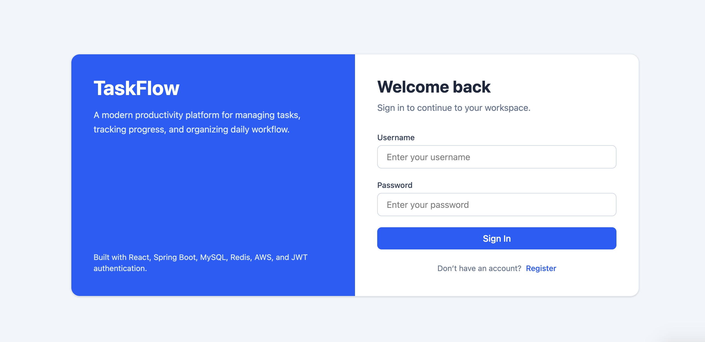
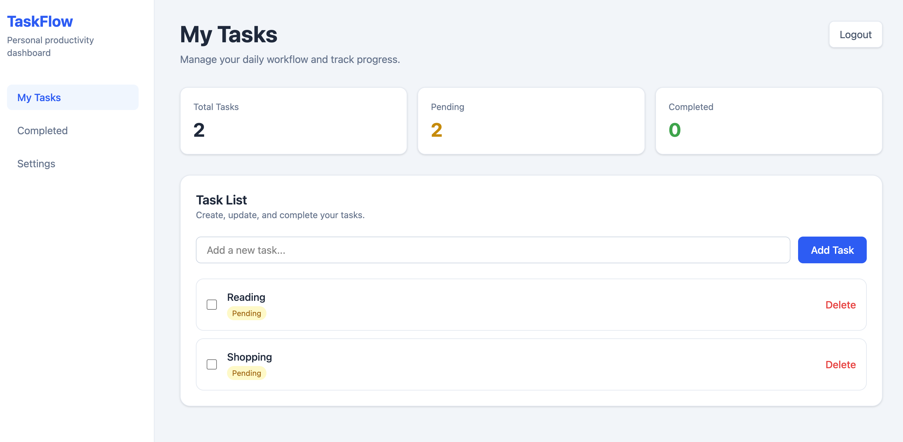

# TaskFlow SaaS Platform

A full-stack productivity platform built with React, Spring Boot, MySQL, Redis, and AWS.  
The platform supports secure multi-user task management with JWT authentication, protected dashboards, and RESTful API integration.

---

## Screenshots

### Login Page



### Task Dashboard



---

## Tech Stack

### Frontend
- React
- JavaScript
- React Router
- Tailwind CSS
- Fetch API

### Backend
- Spring Boot
- MyBatis-Plus
- MySQL
- Redis
- Spring Security
- JWT Authentication

### Deployment
- AWS EC2
- AWS RDS

---

## Features

- User registration and login
- JWT-based stateless authentication
- Protected frontend routes
- Multi-user task isolation
- Create, update, complete, and delete tasks
- Redis cache-aside optimization
- Responsive React/Tailwind dashboard
- RESTful API integration
- AWS cloud deployment

---

## Architecture

Full-stack client-server architecture:

Frontend (React)
↓
REST API (Spring Boot)
↓
MySQL + Redis

The backend follows a three-tier architecture:

Controller → Service → Mapper

---

## Project Structure

```txt
backend/
frontend/
docs/
README.md
